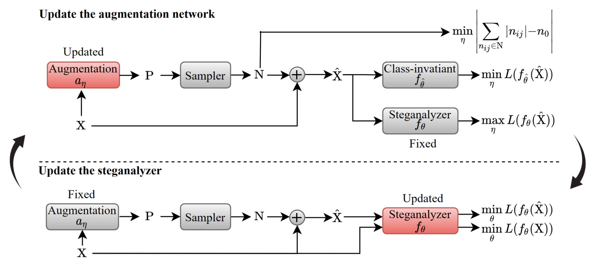

# AAS: Automatic Virtual Data Augmentation for Deep Image Steganalysis

This is the code for the paper "AAS: Automatic Virtual Data Augmentation for Deep Image Steganalysis" (TDSC 2023).




# Running the code
python main.py

# Citing

If you find this repository useful for your work, please consider citing it as follows:

```bibtex
@article{zhang2023aas,
  title={AAS: Automatic Virtual Data Augmentation for Deep Image Steganalysis},
  author={Zhang, Jiansong and Chen, Kejiang and Qin, Chuan and Zhang, Weiming and Yu, Nenghai},
  journal={IEEE Transactions on Dependable and Secure Computing},
  year={2023},
  publisher={IEEE}
}
```

